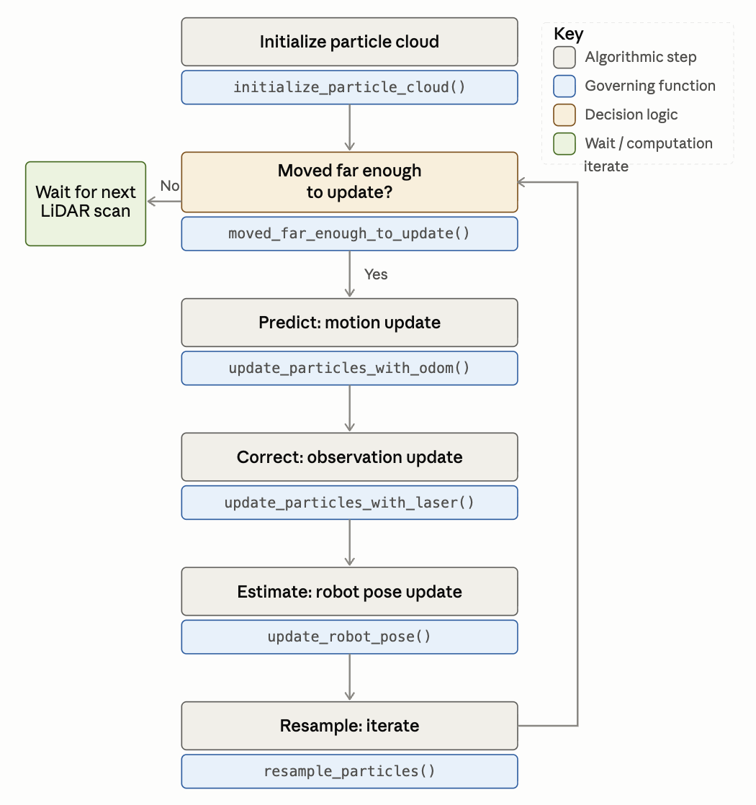

# Robot Localization

Given a map of the world, use the robotics wheel odometry and LiDAR sensors to localize itself in the world.

## Running the Particle Filter
To launch the particle filter, run the following:

**Launch rviz2 and pass configuration file**
``` 
$ rviz2 -d ~/ros2_ws/src/robot_localization/rviz/turtlebot_bag_files.rviz
```
**Launch the particle filter and load the map**
```
$ ros2 launch robot_localization test_pf.py map_yaml:=src/robot_localization/maps/mac_1st_floor_9_23.yaml
```
**Play the bag file**
```
$ ros2 bag play ros2_ws/src/robot_localization/bags/macfirst_floor_take_1 --clock
```

<br>
</br>

## Particle Filter: High-Level Concept Overview

### Workflow diagram



<br>
</br>

### 1. Initialize Particle Cloud
---
`initialize_particle_cloud()`

When the filter starts (or receives a new initial pose estimate from RViz), it seeds a cloud of `n_particles` (500) hypotheses. Each particle's `(x, y, theta)` is drawn from a normal distribution centered on the robot's starting pose, and every particle begins with equal weight. This cloud represents the initial belief over where the robot could be in the map.

### 2. Predict: Motion Update
---
`update_particles_with_odom()`

Once the robot has moved more than `d_thresh` (0.2 m) or `a_thresh` (π/6 rad) since the last update (`moved_far_enough_to_update()`), the filter computes the odometry delta `(Δx, Δy, Δtheta)` since the last update and applies it to every particle, adding Gaussian noise (`odom_noise`, `odom_heading_noise`) to model motion uncertainty.

$$
\Delta x = x_t^{odom} - x_{t-1}^{odom}, \qquad \Delta y = y_t^{odom} - y_{t-1}^{odom}, \qquad \Delta\theta = \theta_t^{odom} - \theta_{t-1}^{odom}
$$

$$
x^{(i)} \leftarrow x^{(i)} + \Delta x + \epsilon_x, \qquad y^{(i)} \leftarrow y^{(i)} + \Delta y + \epsilon_y, \qquad \theta^{(i)} \leftarrow \theta^{(i)} + \Delta\theta + \epsilon_\theta
$$

$$
\epsilon_x, \epsilon_y \sim \mathcal{N}(0, 0.2^2), \qquad \epsilon_\theta \sim \mathcal{N}(0, 0.5^2)
$$

### 3. Correct: Obsevation Update
---
`update_particles_with_laser()`

The current LiDAR scan `(r, theta)` is converted from polar to Cartesian coordinates, then transformed into the map frame using each particle's hypothesized pose. Each particle's predicted scan is compared against the map via `OccupancyField.get_closest_obstacle_distance()`; particles whose scan lines up well with real obstacles (low error) are assigned higher weight, and all weights are then normalized to sum to 1 (`normalize_particles()`).

**Polar → Cartesian, robot frame:**
$$
x_k = r_k \cos\theta_k, \qquad y_k = r_k \sin\theta_k
$$

**Robot frame → map frame, per particle $i$:**
$$
\begin{bmatrix} x_k^{map} \\ y_k^{map} \end{bmatrix} =
\begin{bmatrix} \cos\theta^{(i)} & -\sin\theta^{(i)} \\ \sin\theta^{(i)} & \cos\theta^{(i)} \end{bmatrix}
\begin{bmatrix} x_k \\ y_k \end{bmatrix} +
\begin{bmatrix} x^{(i)} \\ y^{(i)} \end{bmatrix}
$$

**Error and weight for particle $i$, over $M$ valid scan points:**
$$
e_k = d\big(x_k^{map}, y_k^{map}\big) \quad \text{(distance to nearest obstacle)}
$$

$$
\bar e^{(i)} = \frac{\sum_{k=1}^{M} e_k}{M^2}, \qquad w^{(i)} = \frac{1}{\min\!\left(1000,\ \bar e^{(i)}\right)^2}
$$

**Normalization:**
$$
w^{(i)} \leftarrow \frac{w^{(i)}}{\sum_{j=1}^{N} w^{(j)}}
$$

### 4. Estimate: Robot Pose Update
---
`update_robot_pose()`

After normalizing weights, the filter takes the top 3 highest-weighted particles and computes the median of their `x`, `y`, and `theta` values as the robot's estimated pose. This estimate is used to correct the `map` → `odom` transform.

### 5. Resample: Iterate
---
`resample_particles()`

The normalized particle weights are used as a probability distribution to draw a new set of `n_particles` particles (`draw_random_sample`), keeping likely hypotheses and discarding unlikely ones. Weights are reset to a small placeholder value, and the loop returns to step 2 as the robot continues moving, progressively converging the cloud around the true pose.
